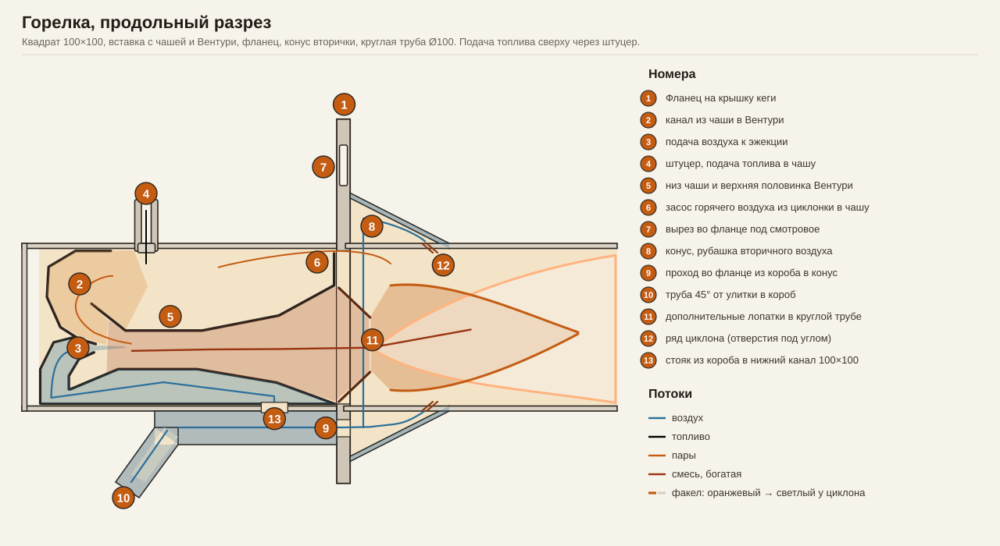
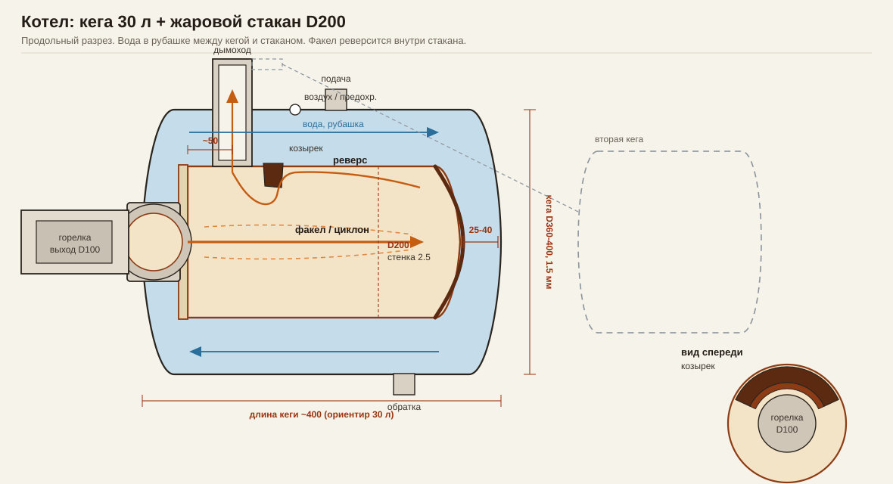
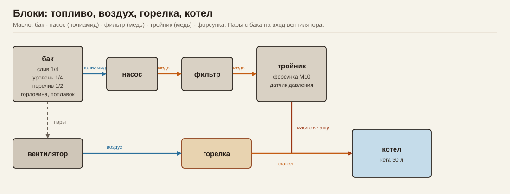
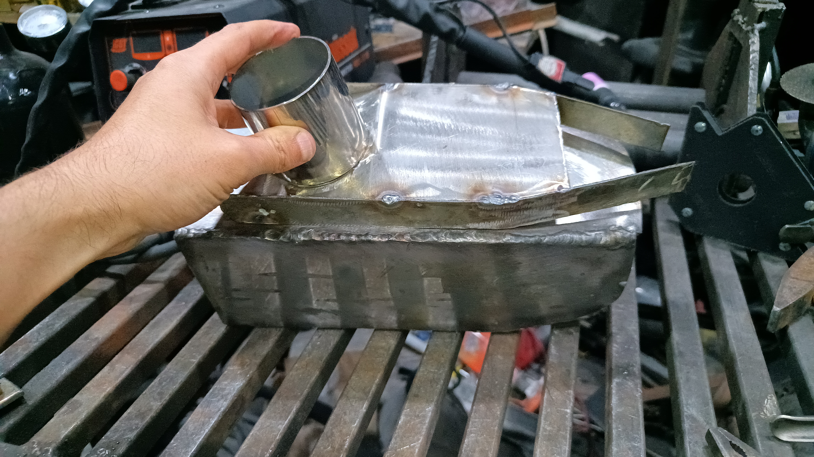
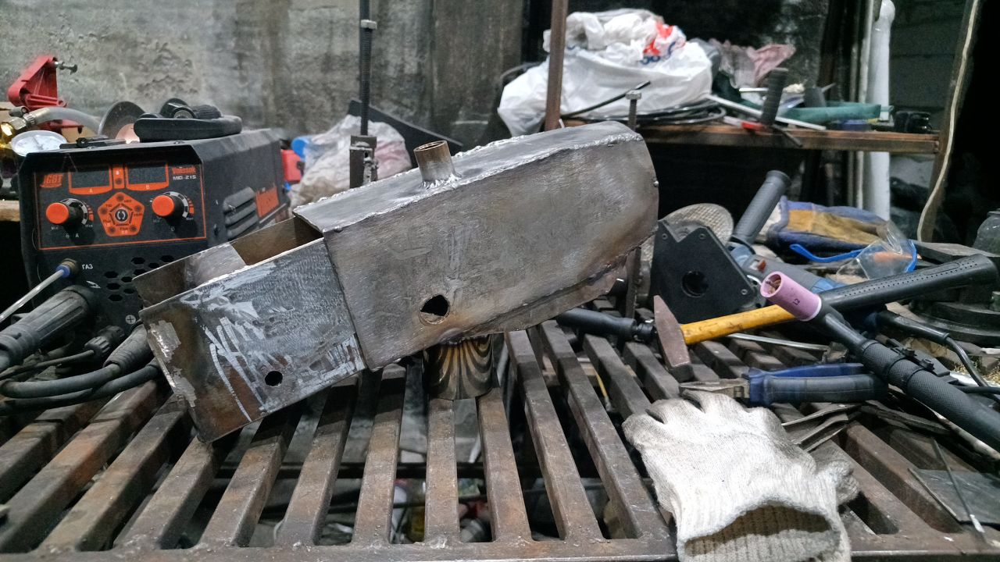

# Жидкотопливная горелка и котёл из кеги 30 л

Документация горелки с принудительным воздухом и испарительной чашей, плюс теплообменник: горизонтальная нержавеющая кега 30 л и жаровой стакан внутри. Ориентир съёма с одной кеги — порядка **10 кВт**.

Схемы горелки: [разрез с размерами (PDF)](./горизонталка_размеры.pdf), [номера](./горизонталка_номера.svg), [блоки установки](./схема-блоков.svg). Модель: [горизонталка.scad](./горизонталка.scad) — в SCAD круглая труба Ø90, по факту выход **Ø100**.

---

## Конструктивные узлы горелки

### 1. Внешний модуль (за пределами котла)

* **Корпус:** профильная труба **100×100 мм**.
* **Нагнетание:** турбовентилятор. Труба 45° **(10)** в нижний короб. Из короба воздух идёт вправо по каналу под вставкой; у фланца через разрыв часть попадает в горелку, затем под чашей назад в сопло **(3)**. Третья ступень — проход **(9)** в кожух циклона.

### 2. Внутренняя вставка

* **Штуцер подачи топлива (4):** отверстие сверху в крыше чаши, через него капает масло.
* **Чаша и верх Вентури (5):** низ испарительной чаши и верхняя половинка сопла Вентури — один контур. Сужение/расширение, поток для засасывания паров, примерно половина воздуха горелки. Смесь уходит вправо в круглую трубу.
* **Засос в чашу (6):** справа в чашу затягивается горячий воздух из циклонки, чтобы масло лучше испарялось.
* **Канал из чаши в Вентури (2):** пары из чаши идут в горло эжекции.
* **Подача воздуха (3):** часть воздушного тракта к эжекции.
* **Узел растопки:** газ сбоку в начале канала смешения. Первый выход на режим — газовым факелом, масло самотёком.
* **Электроды масла:** резьбы по бокам после Вентури (ещё нет).
* **Датчик пламени:** термобатарея на газовый клапан (~750 мА удержания). Кончик в факеле сразу за Вентури, буртик в упор штуцера (ещё нет).

### 3. Жаровая часть горелки (входит в стакан котла)

* **Фланец на крышку кеги:** стойка **(1)** — часть этого фланца. **(7)** — вырез во фланце под смотровое; закрывается шторкой или герметичным окном с жаропрочным стеклом.
* **Переходник:** квадрат 100×100 → круглая труба **Ø100 мм**.
* **Кожух третьей ступени (8):** от фланца к круглой трубе. Питается через проход во фланце **(9)** из нижнего короба.
* **Циклон (12):** ряд отверстий под углом по кругу трубы, напротив стыка кожуха с трубой. Воздух из кожуха закручивает факел. Этого узла ещё нет.
* **Дополнительные лопатки (11)** в круглой трубе.

---

## Регламент запуска

1. Датчик пламени в режим ожидания.
2. Клапан газа, искра на разрядник, вентилятор на минимуме. Газ загорается.
3. Газовый факел прогревает чашу и канал до испарения масла.
4. Подача масла. Масло вскипает, пары каналом **(2)** идут в Вентури.
5. Датчик видит стабильное пламя масла. Газ и разрядник выключаются. Обороты вентилятора — под рабочую мощность.

---

## Котёл (теплообменник)

Горизонтальная кега **30 л, нержавейка ~1.5 мм** — водяная рубашка. Внутри — жаровой стакан **Ø200 мм, стенка 2.5 мм**. Горелка (Ø100) на **передней крышке**. Дымоход врезан в **обечайку кеги сверху**, примерно **50 мм** от этой крышки: гильза через водяную рубашку в стакан (швы к кеге и к стакану). Вода только между кегой и стаканом; газы внутри стакана.

Ход газов: факел в заднюю стенку, реверс **по своду** к дымоходу, у козырька огибание вниз и в трубу. Ориентир съёма с одной кеги — порядка 10 кВт. Вторая кега на выхлопе — позже, конвективная секция.

### Задник

Не 2.5 мм, а диск из дна нержавеющей сковороды **~5 мм**, если дно **монолитное** (не сэндвич с алюминием). Слабый магнетизм при отказе индукции — нормально для аустенита после штамповки; варить как 304 (308L / 309L).

Задник **мокрый**: снаружи вода, щель до днища кеги **25–40 мм**, чтобы не встать паровая подушка. Сухой диск в факеле прогорит независимо от толщины. Выпуклость сковороды удобнее вогнуть к факелу (пузо в воду). Борта сковороды не нужны — только круг под Ø200.

### Козырёк

Пластина внутри стакана, сверху, **правее дымохода** (глубже в топку). Реверс по своду упирается в неё, огибает снизу и уходит в трубу. Нижняя кромка выше оси горелки. На виде спереди — сектор по верхней дуге стакана.

На первом огне можно без козырька. Кольца и шнек **в факеле** не ставить.

### Обвязка (минимум)

* подача сверху / сзади рубашки, обратка снизу;
* воздух в верхней точке и предохранительный клапан;
* расширительный бак;
* не гонять котёл ледяной обраткой (смеситель или большой объём системы).
* Для отработки клапан «как у газа, строго 60 °C» не панацея: сера даёт более высокую кислотную точку росы. Клапан всё равно полезен, чтобы не кормить теплообменник холодной водой.

---

## Топливо

Трасса к форсунке собрана. От тройника (форсунка + датчик давления, вход M10) медная трубка на фильтр, от фильтра до насоса снова медь, от насоса до бака — полиамид.

Бачок ещё собрать: снизу слив, сбоку прозрачная трубка уровня на двух фитингах с тройниками — слив и уровнемер на **1/4**. Сверху штуцер **1/2** под слив перелива и дюймовая горловина. Поплавковый датчик уровня. Отвод воздуха с бака на вход вентилятора, чтобы пары шли в топку с воздухом, а не в помещение.

---

## Порядок сборки и прогресс

### Горелка

- [x] Пластины вставки
- [x] Сердечник сварен, без циклона
- [x] Короб воздуха, труба, сужение за фланец
- [x] Посадка форсунки, тройник, датчик давления, вход M10
- [x] Отверстие под газ
- [x] Штуцер газа
- [x] Вентилятор: улитка от газового котла, мотор аккумуляторной БШМ BLDC
- [x] Трасса масла: медь тройник–фильтр–насос, полиамид насос–бак
- [ ] Тест: растопка газом, масло самотёком, вентилятор вручную
- [ ] Бачок: слив и уровнемер 1/4, перелив 1/2, горловина 1", поплавок, пары на вентилятор
- [ ] Штуцер термобатареи за Вентури
- [ ] Электроды розжига: резьбы по бокам после Вентури
- [ ] Фланец на крышку кеги
- [ ] Круглая жаровая труба, съёмная
- [ ] Отверстия циклона в круглой трубе
- [ ] Кожух третьей ступени: сложная форма, на винты к фланцу сзади

### Котёл

- [ ] Вырез в крышке кеги под фланец горелки
- [ ] Жаровой стакан Ø200 × 2.5 мм
- [ ] Мокрый задник ~5 мм (диск сковороды, не сэндвич)
- [ ] Дымоход в обечайку, ~50 мм от крышки, гильза через рубашку
- [ ] Сборка кеги со стаканом, штуцеры рубашки
- [ ] Гидроиспытание
- [ ] Козырёк правее дымохода (первый огонь можно без него)
- [ ] Вторая кега на выхлопе — позже
