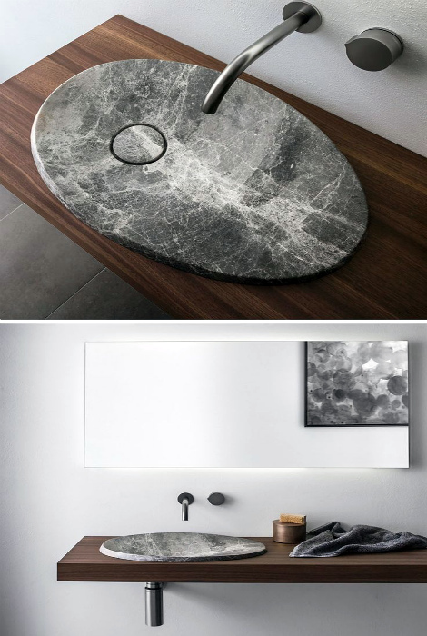

# Технология изготовления раковины из архитектурного бетона

Инструкция по созданию кастомной матрицы (формы) методом натяжения ткани и заливке декоративной раковины со смещенным сливом.

---

## Часть 1: Изготовление матрицы (Формы)

### Необходимые материалы:
*   Канализационная ПВХ труба Ø 110 мм.
*   Листовой пластик (или полосы, выровненные из ПВХ трубы при помощи строительного фена).
*   Эластичная ткань (синтетика/бифлекс).
*   Эпоксидная смола.

### Пошаговый регламент сборки формы:
1.  **Создание бортов и радиусов:** Скругления чаши сформировать из продольно разрезанных секторов ПВХ трубы Ø 110 мм. Внешний периметр (полосу бордюра) выставить из листового пластика или прогретых и выпрямленных полос той же трубы.
2.  **Позиционирование слива:** Жестко зафиксировать закладную под сливное отверстие. Позиция — со смещением на **1/3 от центра чаши**. Вокруг закладной сформировать почти ровную округлую площадку с минимальным уклоном к центру слива.
3.  **Натяжение геометрии:** Приклеить эластичную ткань к верхним краям бортов и к центральной округлой площадке слива. Ткань натягивается с формированием естественных складок по направлению векторов растяжения.
4.  **Композитная жесткость:** Пропитать натянутую ткань эпоксидной смолой. После полимеризации смолы получается жесткая, легкая и бесшовная глянцевая чаша-матрица для заливки бетона.

## 📸 Визуальный ориентир

*Примечание к дизайну: Итоговая раковина будет близка к референсу по пластике чаши, но с **прямоугольным внешним краем и скругленными углами**.*

---

## Часть 2: Спецификация бетонной смеси

Рецептура декоративного тераццо-бетона с объемным армированием.

| Компонент | Назначение / Свойства |
| :--- | :--- |
| **Белый плиточный клей** | Базовое вяжущее (высокая адгезия и пластичность) |
| **Портландцемент (серый)** | Небольшая добавка для корректировки прочности камня |
| **Мраморная крошка** | Декоративный наполнитель (под последующую шлифовку) |
| **Сухой колер** | Серый + зеленый красители (для получения сложного холодного оттенка) |
| **Акриловый концентрат** | Пластификатор-полимер (удерживает влагу, снижает хрупкость) |
| **Суперпластификатор** | Разжижитель смеси (минимизирует количество воды, убирает поры) |
| **Щелочестойкая стеклофибра** | Объемное армирование тонкостенной чаши |

---

## Часть 3: Заливка и финишная обработка

1.  **Подготовка матрицы:** Покрыть эпоксидную форму разделительным составом (воск или силиконовая смазка), чтобы бетон не прилип к смоле.
2.  **Приготовление раствора:** 
    *   Сухое смешивание: соединить белый клей, цемент, мраморную крошку, фибру и пигменты.
    *   Затворение: ввести воду, смешанную с суперпластификатором и акриловым концентратом. Замешать до состояния плотной литой массы.
3.  **Формование:** Заполнить форму составом. Тщательно простучать борта матрицы или использовать виброплатформу для выгонки пузырей воздуха и плотной укладки мраморной крошки к лицевой поверхности.
4.  **Распалубка и проявление текстуры:** Спустя 2-3 суток извлечь раковину из формы. Пройтись по чаше алмазными черепашками (шлифовка), чтобы вскрыть срез мраморной крошки и получить эффект «тераццо».
5.  **Финиш:** Запечатать поры полиуретановым лаком Antega Lux в 2 слоя (из вашей основной технологии).
