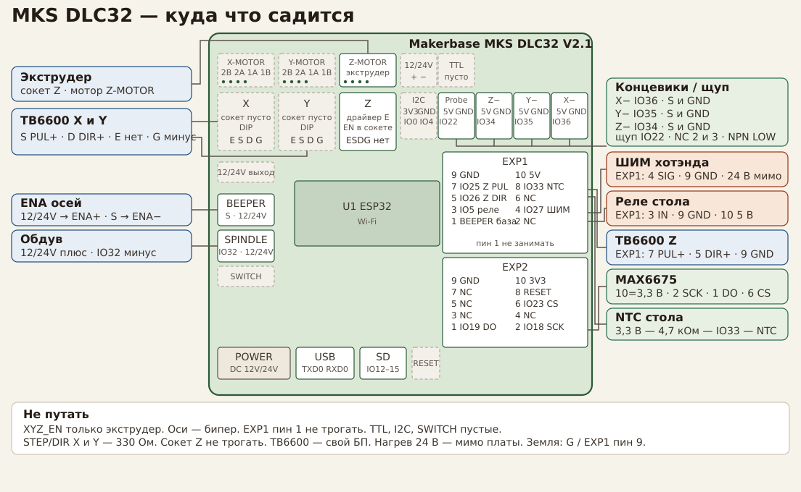

# Одноэкструдерный принтер на MKS DLC32 V2.1

Плата: **MKS DLC32 V2.1**, модуль **ESP32**. Прошивка: **Marlin 2.1** (ветка `bugfix-2.1.x`), среда сборки `mks_dlc32_v2_1`.

X, Y и Z идут через **TB6600**. Экструдер сидит на съёмном драйвере в сокете Z, мотор — на клемме Z-MOTOR. Хотэнд — термопара MAX6675, нагрев внешним ШИМ-модулем и ПИД. Стол — NTC и реле. Обдув детали — ключ разъёма SPINDLE. Вентилятор радиатора включён вместе с БП нагрева.

Сокеты X и Y пустые. Микрошаг и ток TB6600 — на DIP драйверов. У экструдера микрошаг — DIP у сокета Z, ток — потенциометр модуля.

Готовые файлы: `mks-dlc32/pins_MKS_DLC32.h`, `mks-dlc32/Configuration.h`, `mks-dlc32/Configuration_adv.h`.



## Что куда посажено

Сдвигатель 74HC595 отдаёт STEP/DIR осей X, Y и сокета Z. Сокет Z — экструдер. Ось Z сидит на EXP1, штыри 7 и 5 (IO25 и IO26), оба по 5 В. Все TB6600 включаются с разъёма бипера. Экструдер — с XYZ_EN. Реле стола — EXP1 пин 3. TTL пустой. Сокеты X и Y пустые.

| Сигнал | Куда | Уровень |
|---|---|---|
| X STEP / DIR | внешний разъём X, пины S и D | 5 В, TB6600 |
| Y STEP / DIR | внешний разъём Y, пины S и D | 5 В, TB6600 |
| Z STEP | EXP1 пин 7, IO25 | 5 В, буфер, TB6600 PUL+ |
| Z DIR | EXP1 пин 5, IO26 | 5 В, буфер, TB6600 DIR+ |
| E STEP / DIR | сокет Z и клемма Z-MOTOR | съёмный драйвер |
| ENA осей X, Y, Z | разъём бипера | транзистор, 12 В, пины 135 |
| ENA экструдера | пин E / сокет Z, XYZ_EN | ножка 15 сдвигателя, 128 |
| ШИМ хотэнда | EXP1 пин 4, IO27 | 5 В, буфер |
| Реле стола | EXP1 пин 3, LCD_EN | 5 В, U8 инвертирует IO5 |
| Щуп | Probe J12 пин 2, IO22 | 3,3 В, фильтр |
| Обдув детали | разъём SPINDLE, IO32 | ключ на плате, 12/24 В |
| Термопара хотэнда | EXP2, MAX6675 | SPI, тип `-2` |
| Термистор стола | EXP1 пин 8, IO33 | АЦП1, 4,7 кОм к 3,3 В |
| Концевик X | J9, IO36 | S и GND |
| Концевик Y | J10, IO35 | S и GND |
| Концевик Z | J11, IO34 | S и GND |

Хост — USB, 250000 бод, и веб-морда Marlin по Wi-Fi.

## Питание

Три контура, общая только сигнальная земля.

```
БП логики 12–24 В ── гнездо DC платы
                      ├── 5 В и 3,3 В для модулей и делителей
                      ├── SPINDLE: плюс вентилятора детали, минус через ключ IO32
                      └── земля платы

БП моторов ── питание каждого TB6600, не через плату

БП нагрева 24 В ── ШИМ-модуль хотэнда ── термопредохранитель ── картридж
                 ── реле стола ── термопредохранитель ── нагреватель стола
                 ── вентилятор радиатора, постоянно
```

От каждого TB6600 на землю платы идёт отдельный тонкий провод (пин G внешнего разъёма или GND на EXP1). Ток моторов и нагревателей через плату не течёт.

Отдельный резистор на сигнале ШИМ не ставить: подтяжка к земле уже стоит на внешнем модуле и держит ключ закрытым, пока ESP32 не настроил пин. Сигнал — EXP1 пин 4.

## EXP1

Штырь 1 — BEEPER, квадратная площадка. Ряд с нечётными номерами и ряд с чётными:

```
1 BEEPER    2 NC
3 IO5       4 IO27
5 IO26      6 NC
7 IO25      8 IO33
9 GND      10 5V
```

| Штырь | Сигнал | Назначение |
|---|---|---|
| 1, BEEPER | база транзистора | не занимать, моторы с разъёма бипера |
| 3, IO5 | 5 В, U8 инвертирует | IN реле стола |
| 4, IO27 | 5 В, только выход | ШИМ хотэнда → SIG модуля |
| 5, IO26 | 5 В, только выход | Z DIR → TB6600 DIR+ |
| 7, IO25 | 5 В, только выход | Z STEP → TB6600 PUL+ |
| 8, IO33 | 3,3 В, АЦП | термистор стола |
| 9, GND | земля | земля сигналов |
| 10, 5V | 5 В | питание логики модулей |

## EXP2

```
1 IO19     2 IO18
3 NC       4 NC
5 NC       6 IO23
7 NC       8 RESET
9 GND     10 3,3 В
```

| Штырь | Сигнал | Назначение |
|---|---|---|
| 1, IO19 | 3,3 В | MAX6675 DO |
| 2, IO18 | 3,3 В | MAX6675 SCK |
| 6, IO23 | 3,3 В | MAX6675 CS |
| 8, RESET | сброс | не занимать |
| 9, GND | земля | земля модуля MAX6675 |
| 10, 3,3 В | питание | MAX6675 VCC, делитель стола |

## I2C

Не занят. Пин 3 не подключать: низкий уровень на IO0 не даёт плате стартовать.

```
1  3V3
2  GND
3  IO0    SDA, не занимать
4  IO4    SCL, свободен
```

## Probe, J12

Магнитный щуп касания стола. На входе фильтр и подтяжка к 3,3 В, для геркона или NPN это нормально. ШИМ сюда не вешать.

```
1  5V     питание датчика, если ему нужны 5 В
2  IO22   сигнал
3  GND
```

NPN / открытый коллектор: сигнал и земля на штыри 2 и 3. В покое высокий уровень, при касании низкий. В Marlin `Z_MIN_PROBE_ENDSTOP_HIT_STATE LOW`. Если датчик наоборот, поставить `HIGH`. Концевик Z на J11 остаётся для хоуминга, щуп — для `G30` и сетки. `USE_PROBE_FOR_Z_HOMING` не включать, пока не выставлен `NOZZLE_TO_PROBE_OFFSET`.

## Доработка платы

Схемы V2.2 у Makerbase нет, файлы кончаются на V2.1_003. С V2.0 на V2.1 сдвигатель и бипер не менялись. Номера Q5 и резисторов на V2.2 могут разъехаться, перед пайкой прозвонить.

1. У моторных разъёмов должна стоять 74HC595 или 74AHCT595. Ножка 15 — пин E разъёмов. Ножка 7 — EXP1 BEEPER. Другая микросхема — эту разводку не делать.
2. Разъём бипера — ENA всех TB6600. Транзистор оставить: он сажает ENA− на землю, 12 В тянет три-четыре оптопары. EXP1 пин 1 не использовать, это база.
3. Ножку EN съёмного драйвера экструдера оставить в сокете: её включает XYZ_EN. В сокеты X и Y модули не ставить.
4. Ножку 15 сдвигателя не отгибать. Пин E разъёмов X и Y к TB6600 не подключать. Резистор EN до сокета Z, если килоомы, заменить на 330 Ом, иначе экструдер не выключится по M84. Резисторы STEP/DIR сокета Z не трогать. На STEP/DIR разъёмов X и Y килоомы заменить на 330 Ом.

## TB6600

Общий катод на STEP/DIR. ENA всех TB6600 — с разъёма бипера. Плюс разъёма (12 В) на все ENA+. Минус разъёма (коллектор транзистора) на все ENA−. PUL− и DIR− по-прежнему на землю платы (пин G или EXP1 пин 9). Высокий уровень на 595 включает транзистор, оптопара горит, драйвер выключается. В Marlin у X, Y и Z `ENABLE_PIN 135` и `ENABLE_ON 0`. `M84` должен отпустить валы; если держит, поменять `ENABLE_ON` сразу у трёх осей.

Экструдер на XYZ_EN, `E_ENABLE_ON 0`. Пин E разъёмов к внешним драйверам не вести.

```
X, Y:  S → PUL+    D → DIR+    G → PUL−, DIR−
       E не подключать
Z:     EXP1 пин 7 (IO25) → PUL+
       EXP1 пин 5 (IO26) → DIR+
       EXP1 пин 9         → PUL−, DIR−
X, Y, Z ENA:  плюс бипера → ENA+
              минус бипера → ENA−
```

Разъём Z S и D не занимать: это STEP/DIR экструдера, они уже приходят в сокет. Мотор экструдера — на клемму Z-MOTOR.

Два мотора на X или на Y — два TB6600 параллельно на одни S, D и G.

Разъём TTL не занимать. Обдув на SPINDLE, это тот же IO32, но уже силовой ключ.

## Концевики

Разъёмы на плате, у каждого три штыря: 1 = 5 В, 2 = S, 3 = GND.

| Ось | Разъём | Сигнал |
|---|---|---|
| X | J9 | IO36 |
| Y | J10 | IO35 |
| Z | J11 | IO34 |

Механические NC: штырь 2 и штырь 3. Штырь 1 (5 В) на механический концевик не подавать. На сигнале уже стоит подтяжка к 3,3 В.

Пока концевик нажат (контакт замкнут на землю), на пине низкий уровень. Срабатывание — высокий. В Marlin это `HIT_STATE HIGH`.

## Термисторы

Хотэнд — термопара K на MAX6675, SPI на EXP2, слот SD не трогать. Питание модуля только 3,3 В с EXP2 пин 10: линия DO идёт прямо в ESP32, 5 В её спалит.

```
EXP2 пин 10 (3,3 В) → VCC
EXP2 пин 9          → GND
EXP2 пин 2 (IO18)   → SCK
EXP2 пин 1 (IO19)   → SO / DO
EXP2 пин 6 (IO23)   → CS
термопара T+ / T−   → входы MAX6675
```

В прошивке `TEMP_SENSOR_0 -2`. Если при нагреве показание падает, поменять T+ и T−. Обрыв термопары даёт максимум или ошибку.

Стол — NTC 100 кОм на ADC1. К 5 В не подключать.

```
EXP2 пин 10 (3,3 В) ── 4,7 кОм ── EXP1 пин 8 (IO33) ── термистор стола ── EXP1 пин 9
```

Тип `1`. Если на 60 °C расходится с термопарой больше чем на несколько градусов, поставить `11`. Земля датчика — земля платы, не минус БП нагрева.

## Нагреватели

Силовые 24 В через плату не идут. У картриджа и у стола свой термопредохранитель на нагревателе.

Хотэнд, ПИД, активный высокий уровень. ШИМ-модуль:

```
EXP1 пин 4 (IO27) → SIG
EXP1 пин 9        → GND модуля
24 В БП нагрева   → силовой вход модуля → термопредохранитель → картридж
```

Подтяжка SIG к земле уже на модуле, второй резистор не ставить. На J12 хотэнд не вешать: там фильтр и щуп. `M104 S60` зажигает светодиод модуля, `M104 S0` гасит. Картридж подключать после этой проверки.

Стол, реле, двухпозиционный режим, без ПИД. Выход — EXP1 пин 3. U8 инвертирует IO5, поэтому `HEATER_BED_PIN 5` и `HEATER_BED_INVERTING true`.

```
EXP1 пин 3 (LCD_EN) → IN
EXP1 пин 9          → GND
EXP1 пин 10 (5 В)   → VCC катушки
24 В БП нагрева     → контакты реле → термопредохранитель → нагреватель стола
```

`BEEPER_PIN` не определять. До нагревателя `M140 S60` должен щёлкнуть реле. Если при нагреве на штыре 3 низкий уровень, `HEATER_BED_INVERTING` вернуть в `false`.

Вентилятор радиатора хотэнда сидит прямо на БП нагрева и крутится всё время, пока этот БП включён. Обдув детали — SPINDLE: плюс на 12/24 В платы, минус на ключ IO32. TTL не занимать.

## Marlin

Ветка `bugfix-2.1.x`. В `platformio.ini` в корне:

```ini
default_envs = mks_dlc32_v2_1
```

Плата в дереве Marlin не описана, добавляются три места.

`Marlin/src/core/boards.h`, следом за `BOARD_MM_JOKER`:

```cpp
#define BOARD_MKS_DLC32               7012  // MKS DLC32 V2.1, ESP32, I2S stepper stream
```

`Marlin/src/pins/pins.h`, следом за блоком `MM_JOKER`:

```cpp
#elif MB(MKS_DLC32)
  #include "esp32/pins_MKS_DLC32.h"               // ESP32                                env:mks_dlc32_v2_1
```

`Marlin/src/pins/esp32/pins_MKS_DLC32.h`:

```cpp
#pragma once

#include "env_validate.h"

#if HAS_MULTI_HOTEND || E_STEPPERS > 1
  #error "MKS DLC32 printer build supports 1 hotend / 1 E stepper."
#endif

#define BOARD_INFO_NAME "MKS DLC32 V2.1"

#ifndef I2S_STEPPER_STREAM
  #define I2S_STEPPER_STREAM
#endif
#if ENABLED(I2S_STEPPER_STREAM)
  #define I2S_WS                              17
  #define I2S_BCK                             16
  #define I2S_DATA                            21
#endif

// 128 + N  ==  выход сдвигателя I2SO.N
// 0 EN, 1 X_STEP, 2 X_DIR, 3 Z_STEP, 4 Z_DIR, 5 Y_STEP, 6 Y_DIR, 7 BEEPER

#define X_STEP_PIN                           129
#define X_DIR_PIN                            130
#define X_ENABLE_PIN                         135  // бипер, все TB6600

#define Y_STEP_PIN                           133
#define Y_DIR_PIN                            134
#define Y_ENABLE_PIN                         135

#define Z_STEP_PIN                            25  // EXP1 пин 7 → TB6600 PUL+
#define Z_DIR_PIN                             26  // EXP1 пин 5 → TB6600 DIR+
#define Z_ENABLE_PIN                         135

#define E0_STEP_PIN                          131  // сокет Z
#define E0_DIR_PIN                           132
#define E0_ENABLE_PIN                        128  // XYZ_EN, экструдер

#define X_STOP_PIN                            36
#define Y_STOP_PIN                            35
#define Z_STOP_PIN                            34
#define Z_MIN_PROBE_PIN                       22  // J12 пин 2

#define TEMP_0_CS_PIN                         23  // EXP2 пин 6, MAX6675 CS
#define TEMP_0_SCK_PIN                        18  // EXP2 пин 2
#define TEMP_0_MISO_PIN                       19  // EXP2 пин 1, DO
#define TEMP_0_PIN                TEMP_0_CS_PIN
#define TEMP_BED_PIN                          33  // ADC1, EXP1 пин 8

#define HEATER_0_PIN                          27  // EXP1 пин 4, ШИМ хотэнда
#define HEATER_BED_PIN                         5  // EXP1 пин 3, U8 инвертирует
#define FAN0_PIN                              32  // SPINDLE

#define HEATER_0_INVERTING                 false
#define HEATER_BED_INVERTING                true

#define SD_SCK_PIN                            14
#define SD_MISO_PIN                           12
#define SD_MOSI_PIN                           13
#define SD_SS_PIN                             15
#define SD_DETECT_PIN                         39
```

Если при `M140 S60` на штыре 3 низкий уровень, `HEATER_BED_INVERTING` вернуть в `false`.

### Configuration.h

Меняются только эти строки. Экрана на DLC32 нет. Ось Z на EXP1, штыри 7 и 5. Wi-Fi — `WIFISUPPORT` и `WEBSUPPORT`. USB остаётся первым портом.

```cpp
#define MOTHERBOARD BOARD_MKS_DLC32
#define CUSTOM_MACHINE_NAME "DLC32 Printer"

#define SERIAL_PORT 0
#define BAUDRATE 250000
#define SERIAL_PORT_2 -1
#define BAUDRATE_2 250000

#define X_DRIVER_TYPE  TB6600
#define Y_DRIVER_TYPE  TB6600
#define Z_DRIVER_TYPE  TB6600
#define E0_DRIVER_TYPE A4988

#define EXTRUDERS 1
#define DEFAULT_NOMINAL_FILAMENT_DIA 1.75

#define TEMP_SENSOR_0 -2
#define TEMP_SENSOR_BED 1

#define PIDTEMP
// PIDTEMPBED не включать: стол на реле, двухпозиционный режим

#define HEATER_0_MAXTEMP 275
#define BED_MAXTEMP 120

#define PREVENT_COLD_EXTRUSION
#define EXTRUDE_MINTEMP 170

#define X_MIN_ENDSTOP_HIT_STATE HIGH
#define Y_MIN_ENDSTOP_HIT_STATE HIGH
#define Z_MIN_ENDSTOP_HIT_STATE HIGH
#define Z_MIN_PROBE_ENDSTOP_HIT_STATE LOW

#define FIX_MOUNTED_PROBE
#define NOZZLE_TO_PROBE_OFFSET { 0, 0, 0 }

#define DEFAULT_AXIS_STEPS_PER_UNIT   { 80, 80, 400, 93 }
#define DEFAULT_MAX_FEEDRATE          { 200, 200, 5, 25 }
#define DEFAULT_MAX_ACCELERATION      { 500, 500, 100, 1000 }
#define DEFAULT_ACCELERATION          500
#define DEFAULT_RETRACT_ACCELERATION  1000
#define DEFAULT_TRAVEL_ACCELERATION   500

#define INVERT_X_DIR false
#define INVERT_Y_DIR false
#define INVERT_Z_DIR false
#define INVERT_E0_DIR false

#define X_ENABLE_ON 0
#define Y_ENABLE_ON 0
#define Z_ENABLE_ON 0
#define E_ENABLE_ON 0

#define X_HOME_DIR -1
#define Y_HOME_DIR -1
#define Z_HOME_DIR -1

#define X_BED_SIZE 200
#define Y_BED_SIZE 200
#define Z_MAX_POS 200

#define SDSUPPORT
#define EEPROM_SETTINGS
```

`steps/mm` выше — старт для ремня GT2, шкив 20 зубов, микрошаг 16, винт Z с шагом 8 мм и прямой экструдер. Своя механика считается так:

```
steps/mm = (200 шагов на оборот × микрошаг) / мм за оборот
```

Ремень 2 мм и шкив 20 зубов: миллиметры за оборот = 40. Микрошаг 16 даёт 80. Винт T8x8 даёт 400 при микрошаге 16, T8x2 даёт 1600. После сборки калибровка: `M92`, затем `M500`.

Направления `INVERT_*_DIR` выставляются на столе, с отсоединённой механикой: `G91` и `G1 X10 F300` должны крутить вал в нужную сторону.

### Configuration_adv.h

Пауза DIR у клонов TB6600 по даташиту от 5 мкс, импульс STEP от 2,5 мкс. Заводские значения Marlin для TB6600 короче по DIR, их перекрыть:

```cpp
#define MINIMUM_STEPPER_POST_DIR_DELAY 5000
#define MINIMUM_STEPPER_PRE_DIR_DELAY  5000
#define MINIMUM_STEPPER_PULSE_NS       4000
#define MAXIMUM_STEPPER_RATE           100000

#define DEFAULT_STEPPER_TIMEOUT_SEC 0

#define WIFISUPPORT
#define WEBSUPPORT
#define WIFI_SSID "CHANGE_ME"
#define WIFI_PWD  "CHANGE_ME"
```

Таймаут удержания ноль: после старта моторы держат вал. `M84` отпускает X, Y и Z через бипер, экструдер через XYZ_EN. `THERMAL_PROTECTION_HOTENDS` и `THERMAL_PROTECTION_BED` оставить включёнными.

Wi-Fi — `WIFISUPPORT` и `WEBSUPPORT`, одновременно `ESP3D_WIFISUPPORT` не включать. `SERIAL_PORT_2 -1` — сокет веб-морды, USB остаётся `SERIAL_PORT 0`. Сборку брать `mks_dlc32_v2_1` (таблица 8 МБ). `WIFI_SSID` и `WIFI_PWD` подставить до прошивки: без сети штатный Marlin крутит перезагрузку, своей точки доступа нет. В браузере `http://marlinesp.local` или IP из `M115` / последовательного лога. Bluetooth штатный Marlin портом не делает.

## Сборка и первый пуск

1. Клонировать `bugfix-2.1.x`, внести плату и оба конфига.
2. `pio run -e mks_dlc32_v2_1 -t upload`. Если загрузчик не ловится, зажать BOOT, коротко нажать RESET, отпустить BOOT и повторить заливку.
3. Хост на 250000. В ответ на `M115` должна прийти строка `DLC32 Printer`. В логе загрузки — IP. Телефон в той же сети открывает `http://marlinesp.local`. Стол на IO33 (ADC1), хотэнд на MAX6675, радио температуре не мешает.
4. `M105` при комнатной температуре: хотэнд и стол около комнаты. Ноль или сразу максимум на хотэнде — обрыв термопары или питание MAX6675. То же на столе — делитель или тип датчика.
5. Реле и ШИМ без нагревателей. `M140 S60` щёлкает стол, `M140 S0` отпускает. `M104 S60` открывает ключ хотэнда, светодиод модуля загорается. `M106 S255` крутит обдув, `M107` останавливает.
6. Моторы по одному, муфты сняты. `G91` / `G1 X10 F300`, то же для Y, Z, E. По `G1 E` крутится мотор на клемме Z-MOTOR. По `G1 Z` щёлкает TB6600 на EXP1 штырях 7 и 5. Если по E крутится X или Y, перепутаны провода на разъёмах, не номера 129–134.
7. Концевики: `M119`. Отпущенный NC показывает `TRIGGERED`. Рукой разомкнуть — `open`. Щуп в покое `open`, при касании `TRIGGERED`. Если щуп наоборот, `Z_MIN_PROBE_ENDSTOP_HIT_STATE` поставить в `HIGH`.
8. ПИД хотэнда, уже с картриджем и термопредохранителем: `M303 E0 S200 C8`, затем `M301` по выданным `P I D` и `M500`. Стол двухпозиционный, `M303 E-1` не запускать.
9. Хоуминг `G28` только после того, как направления и концевики проверены отдельно.

`M104`, `M140`, `M109`, `M190`, `G1 E` работают как у обычного принтера. Слайсер — обычный Marlin, один экструдер.
