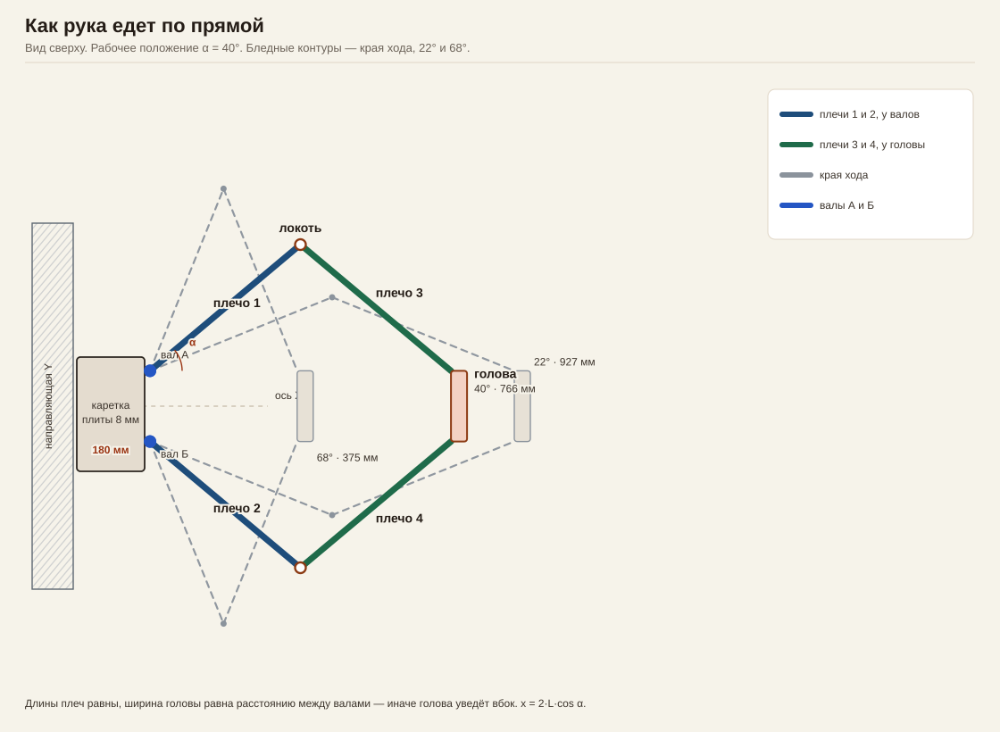
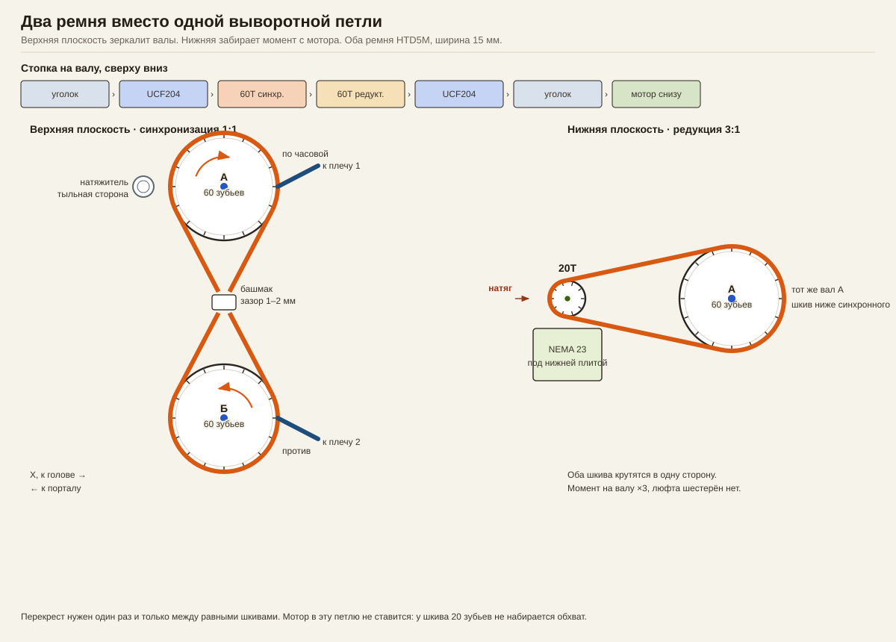
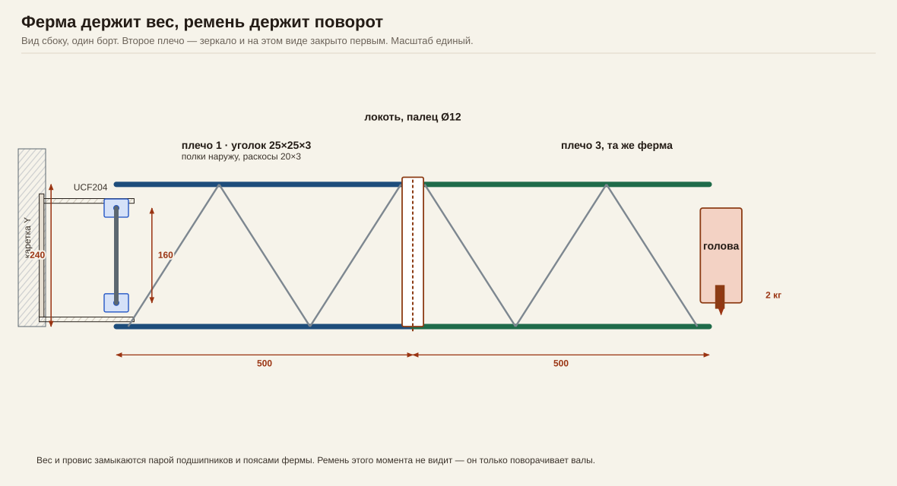
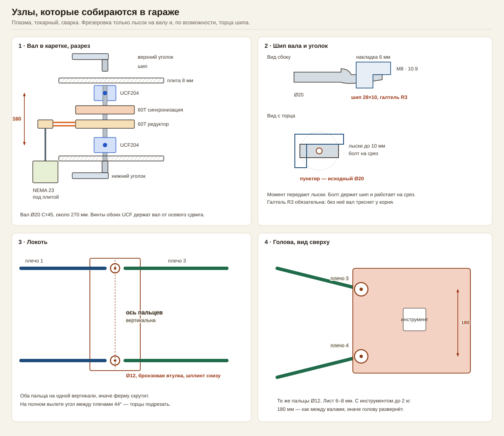

# Горизонтальный Х-манипулятор на зеркальном пантографе

Рука стоит на каретке портала (оси Y и Z) и выдвигает голову только вдоль X. В плане это один механизм с одной степенью свободы: два равных плеча у валов крутятся в противоположные стороны на один и тот же угол, два равных плеча у головы складывают их в прямую.

Рабочее окно при плечах 500 мм — вылет от 375 до 927 мм, ход около 550 мм. Геометрический максимум 1000 мм лежит на особой точке, в работу его не берут.

## Принятые размеры

| | |
|---|---|
| Плечо у вала и плечо у головы | по 500 мм, длины равны |
| Расстояние между валами и между шарнирами головы | по 180 мм, базы равны |
| Рабочий угол α плеча от оси X | 22°…68° |
| Вылет головы в этом окне | 927…375 мм |
| Валы | Ст45, Ø20 мм, длина около 270 мм |
| Подшипники | 4× UCF204, база между центрами 160 мм |
| Ферма | уголок 25×25×3, база поясов 240 мм, раскосы из полосы 20×3 |
| Плиты каретки | лист 8 мм |
| Ремень | HTD5M, ширина 15 мм, два контура |
| Шкивы | 60 зубьев на валах, 20 зубьев на моторе |
| Мотор | NEMA 23, под нижней плитой |
| Голова с инструментом | до 2 кг |

Равенство длин и равенство баз — жёсткое условие. Иначе голова при ходе уходит вбок и разворачивается.

## Схемы



Вид сверху. Синие плечи сидят на валах, зелёные — на голове. Бледные контуры — края рабочего окна. Локти на сложенной руке разъезжаются больше чем на метр.



Два ремня в двух плоскостях одного вала. Верхний перекрещен и зеркалит валы А и Б. Нижний открытый и забирает момент с мотора с передачей 3:1.



Вид сбоку на один борт. Второй борт — зеркало и закрыт первым. Пояса и раскосы держат вес. Ремень этого момента не видит.



Четыре узла, которые делаются плазмой, токарным и сваркой.

## Кинематика

Угол α отсчитывается от оси X наружу. При равных плечах и равных базах вылет головы:

```text
x = 2 · L · cos α
α = arccos( x / (2 · L) )
```

L = 500 мм. Оба вала поворачиваются на один и тот же α в противоположные стороны. Угол между плечом 1 и плечом 3 в плане равен 2α.

| α | вылет x | ширина по локтям | мм хода на градус вала |
|---:|---:|---:|---:|
| 22° | 927 мм | 555 мм | 6,5 |
| 40° | 766 мм | 823 мм | 11,2 |
| 68° | 375 мм | 1107 мм | 16,2 |

От 22° до 68° ход 552 мм. Ближе к 0° плечи вытягиваются в одну линию: малый поворот вала почти не двигает голову, и механизм может щёлкнуть через мёртвую точку. Ближе к 90° локти уходят в стороны больше чем на метр, а растяжение ремня сильнее всего видно на голове.

Шаги мотора в это окно ложатся неравномерно. При 1600 шаг/об на моторе и редукции 3:1 вал получает 4800 шаг/об, то есть 13,3 шага на градус. На вылете 927 мм это около 0,5 мм на шаг, на вылете 375 мм — около 1,2 мм на шаг.

Плечи по 720 мм дали бы в том же угловом окне ход около 800 мм и ширину на сложении около 1,5 м. Пока оставлены 500 мм.

## Два пути нагрузки

Вес гнёт руку в вертикальной плоскости. Мотор крутит её в горизонтальной. Это разные опоры.

На вылете около 1 м голова 2 кг даёт момент порядка 20 Н·м. Сами плечи тяжелее головы: четыре уголка по 500 мм, раскосы, шарниры — ориентир 8–10 кг подвижной стали. С ними момент у каретки на полном вылете порядка 40–50 Н·м на оба борта вместе. База подшипников 160 мм принимает это парой сил около 150–200 Н на корпус. Для UCF204 (динамическая грузоподъёмность UC204 около 12 кН) запас большой. Удлинение поясов от такой силы — микроны. Реальный провис задают зазор пальцев и кручение коробки каретки. Цель — люфт головы по Z в пределах 0,5 мм: втулки развёрнуты, каретка коробчатая.

Ремень видит только момент вокруг вертикальных валов. NEMA 23 на 2 Н·м через редукцию 3:1 даёт на валу около 5–6 Н·м. На радиусе шкива 60 зубьев (делительный диаметр 95,5 мм) это усилие в ветви порядка 100–150 Н. Допустимое усилие ремня HTD5M шириной 15 мм в исполнении HF — 450 Н, в усиленном HP — 975 Н. Обычного HTD5M-15 хватает, если разгон плавный.

Горизонтальная жёсткость — это жёсткость ремня, приведённая через длинное плечо. Оценка — единицы Н/мм у головы и собственная частота в несколько герц. Отсюда S-образная кривая разгона: она не возбуждает это качание.

## Узлы

### Каретка

Две плиты 8 мм, связанные боковыми щеками в коробку. Коробка крепится к каретке оси Y своим задним торцом; рисунок отверстий берётся с уже стоящей каретки. Внутренняя высота между плитами около 130 мм: туда входят два шкива шириной под ремень 15 мм и зазоры.

UCF204 стоит на внутренней стороне каждой плиты, по два на вал. Квадратный фланец 86 мм, отверстия под болт M10 с шагом 64 мм. Пазы в плите — овальные, ход ±3 мм, только чтобы выставить валы параллельно. Натяг ремня пазами не делают: перекос валов съест геометрию.

Мотор висит под нижней плитой, валом вверх. Тело NEMA 23 в коробку не заталкивается: между шкивами в верхней плоскости проходит перекрест, а длина корпуса 70–80 мм спорит с нижней опорой.

### Вал

Ст45, Ø20 мм. От верхнего шипа до нижнего около 270 мм. Посадочные места под UC204 — гладкие Ø20, ширина кольца 31 мм. Между опорами два шкива 60 зубьев, каждый на шпонке 6×6×20. Между шкивами распорная втулка, чтобы не сходились.

Центра подшипников разнесены на 160 мм. Оба UCF фиксируют вал своими винтами M6; тепловое удлинение такого куска несущественно.

### Шип под уголок

На каждом конце вала две параллельные лыски. Между ними остаётся шип толщиной 10 мм и длиной 28 мм. Переход к Ø20 — галтель не меньше R3. Без галтели трещина пойдёт от корня при первом же изгибе.

В уголок вварена накладка 6 мм с прорезью под шип. Сквозь накладку и шип — болт M8 класса 10.9. Лыски передают момент, болт не даёт шипу выйти и работает на срез. Момент на одном шипе небольшой: крутящий момент ремня делится на верхний и нижний пояс. Опасен не срез болта, а сборка одного пояса без второго — тогда шип принимает весь изгиб консоли.

Верхний и нижний уголки сажаются на один вал и вращаются вместе. Это одно жёсткое плечо, а не параллелограмм из двух независимых тяг.

### Ферма плеча

Два уголка 25×25×3, полки наружу, база 240 мм — от оси верхнего шипа до оси нижнего. На длине 500 мм три раскоса из полосы 20×3. Сварка на стапеле, короткие прихватки вразбежку, потом проварка. Первая панель раскоса стоит у вала, где поперечная сила больше.

Такая же ферма на дистальном плече. Четыре плеча — четыре фермы.

### Локоть

Сварная рамка на конце проксимальной фермы. Два пальца Ø12 Ст45 на одной вертикальной оси, верхний и нижний. Втулка бронзовая, отверстие развернуть по пальцу. Снизу шайба и шплинт.

Ось вертикальна, поэтому складка только в горизонтали. Вертикальный момент веса рамка берёт парой пальцев: при базе 240 мм даже 40 Н·м дают на палец около 170 Н.

На вылете 927 мм угол между плечами в плане 44°. Торцы уголков подрезать, иначе они упрутся друг в друга раньше упора по углу. На сложении 68° угол между плечами 136°, запас по разведению есть.

### Голова

Лист 6–8 мм. Два таких же пальца Ø12. Расстояние между ними 180 мм — то же, что между валами. Инструмент в середине площадки. Масса площадки вместе с инструментом до 2 кг; кабель к инструменту — свободной петлёй или лёгкой цепью вдоль верхнего пояса, с запасом на сложение.

### Ремни

Синхронизация, верхняя плоскость. Два шкива 60 зубьев, межосевое 180 мм, ремень перекрещен один раз. Обхват каждого шкива получается около 240°. В точке перекреста спинки ремня разведены башмаком, зазор 1–2 мм, чтобы не пилили друг друга. Натяг — гладким роликом с ребордами по тыльной стороне, диаметр ролика от 40 мм. Ориентир длины: 144 зуба (720 мм), точное межосевое добирает ролик.

Редукция, нижняя плоскость. Шкив 60 зубьев на валу А и шкив 20 зубьев на моторе, открытый ремень, оба крутятся в одну сторону. Мотор в овальных пазах, ими и натягивается ремень. Ориентир: около 90 зубьев при межосевом около 120 мм. Ступица малого шкива зажимная, под фактический вал мотора (обычно 8 мм).

Передаточное отношение 60/20 = 3. Знак направления задаётся в прошивке так, чтобы рост α складывал руку.

Один ремень на обе задачи здесь не собирается. Перекрест между равными шкивами занимает середину, а шкиву на 20 зубьев нужен обхват около 180°, иначе в зацеплении остаётся 4–5 зубьев. Два коротких контура проще натянуть и проще заменить.

## Управление

Координата X и угол вала связаны арккосинусом. Равные шаги мотора дают разный миллиметраж по ходу руки: от 0,5 мм/шаг на вылете до 1,2 мм/шаг в сложении.

Планировщик, который считает ось линейной, проведёт дугу там, где нужна прямая. Для согласованного хода XYZ угол считается так:

```text
α = arccos( x / (2 · L) )
шаги = α / 360° · 4800
```

Это кинематика LinuxCNC или свой контроллер. В GRBL такой формулы нет, и ось X там останется «градусной».

Разгон — S-кривая. Трапеция на этом плече возбуждает качание головы в горизонтали.

Ноль — датчик на флажке проксимального плеча около α = 60°, в середине окна. В мёртвые точки 0° и 90° рука не упирается: там нет жёсткой связи «градус вала — миллиметр головы».

Программные концы: α от 22° до 68°, вылет от 927 до 375 мм.
