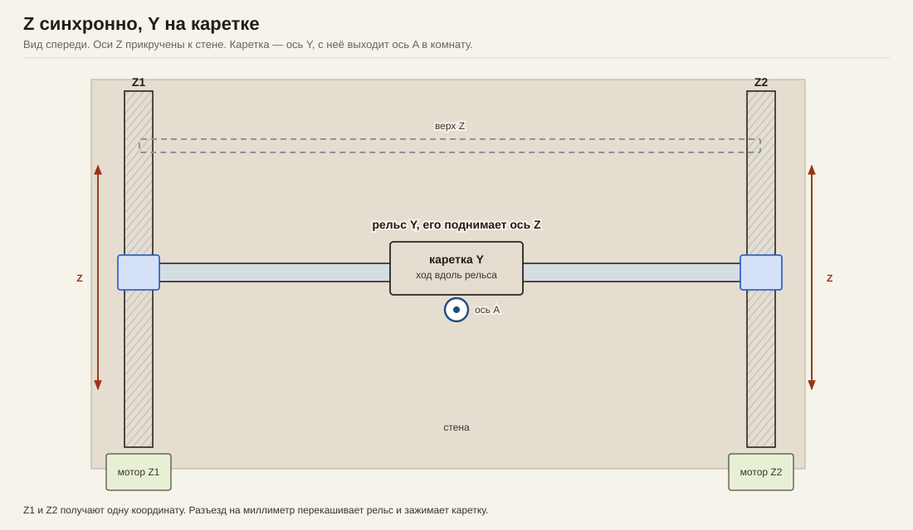
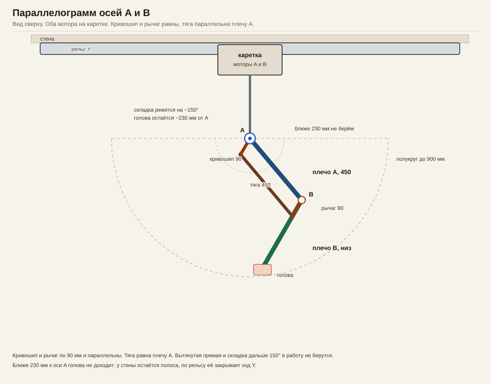
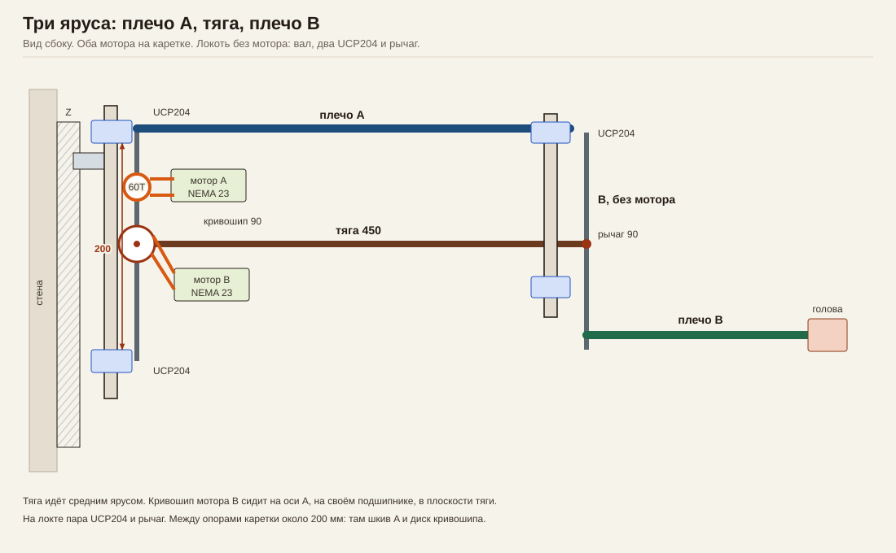
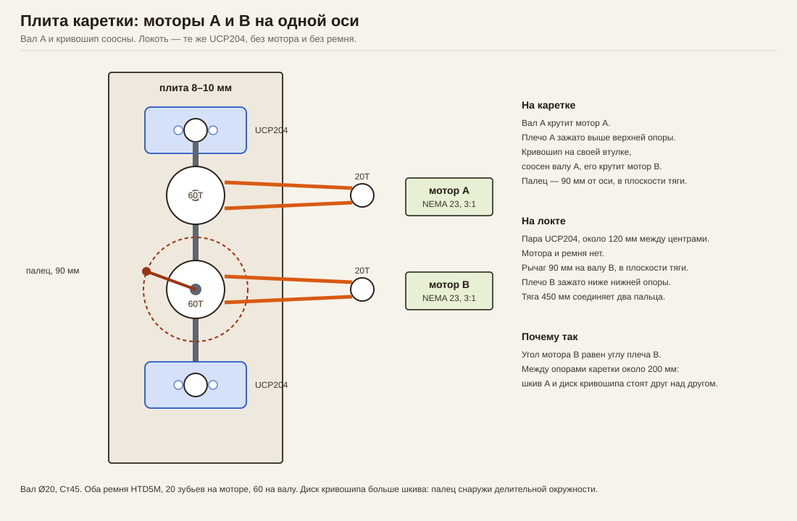

# XY-SCARA: Z, каретка Y, оси A и B

Оси станка: **Z** (моторы Z1 и Z2 ходят синхронно), **Y** (каретка по горизонтальному рельсу), **A** и **B** (SCARA).

Плечо A лежит выше плеча B. В плане они проходят друг над другом и складываются до самой каретки. Оси Z прикручены к стене, за неё рука не заходит. Зона перед стеной — полукруг радиусом до 900 мм.

## Оси

| Ось | Что движется |
|---|---|
| Z, моторы Z1 и Z2, оба на стене | рельс Y целиком, оба конца вместе |
| Y | каретка по этому рельсу |
| A | первое плечо, верхняя плоскость |
| B | второе плечо, нижняя плоскость |

Положение головы: высота = Z, вдоль станка = Y плюс доля руки, вылет = рука от оси A.

## Схемы



Z1 и Z2 прикручены к стене и ходят как одна координата. Каретка на рельсе — ось Y. С неё выходит ось A в комнату.



Рабочее положение и складка на каретку. Пунктир — полукруг перед стеной, радиус до 900 мм.



На каретке плита оси A. На конце верхнего плеча такая же плита оси B. Нижнее плечо выходит под ней.



Один узел на обе оси. Сверху и снизу по UCP204, между ними шкив, мотор на полке той же плиты.

## Рука

Плечи по 450 мм, труба 40×40×2. Голова с инструментом до 2 кг.

Сложенная рука кладёт голову рядом с осью A: плечо B уходит под плечо A, они не сталкиваются. Перед стеной это полукруг. Вытянутая прямая даёт 900 мм и в программу не входит — там рука не передаёт усилие. Рабочий вылет примерно от 0 до 850 мм.

```text
cos B = (x² + y² − 2L²) / (2L²)
B = ±arccos(...)
A = atan2(y, x) − atan2(sin B, 1 + cos B)
```

Знак B — локоть по одну или по другую сторону от цели. Переброс через вытянутое положение в одном ходе не делается. Линейная Y прибавляется отдельно.

На трубе 40×40 провис от 2 кг — доли миллиметра. Люфт сидит в опорах A и B.

## Плита A и плита B

У UCP204 вал параллелен подошве. Обе опоры болтятся к одной вертикальной плите: одна сверху, вторая снизу. Вал Ø20 Ст45 проходит через обе. Между центрами около 120 мм — это плечо, которым пара подшипников держит вес вытянутой руки.

Шкив 60 зубьев сидит на валу между опорами, на шпонке. Мотор NEMA 23 стоит на горизонтальной полке, приваренной к той же плите, его вал вертикальный. Ремень HTD5M, шкив мотора 20 зубьев, передача 3:1.

Плита A закреплена на каретке Y. Плечо A зажато на валу выше верхней опоры.

Плита B стоит на конце плеча A. Узел тот же: два UCP204, мотор, ремень на вал B. Плечо B зажато на валу ниже нижней опоры, поэтому оно идёт под первым. Мотор B едет вместе с локтем, кабель к нему — петлёй вдоль плеча A.

Вес вокруг A и B момента не создаёт: оси вертикальные. Моторы крутят инерцию. Изгиб от головы принимают пары UCP204 и две колонны Z.

## Z и Y

Две колонны прикручены к стене, на каждой свой привод. В прошивке это одна ось Z. При базировании концы рельса выравниваются по двум датчикам, дальше Z1 и Z2 едут вместе. Перекос на миллиметр зажимает каретку.

Каретка Y — обычная линейная ось, шаг постоянный. Ход равен длине рельса за вычетом каретки.

Кисть, если голове нельзя крутиться вместе с рукой: отдельный ремень 1:1 от шкива, закреплённого на плите A, до шкива головы, с роликом на плите B.
