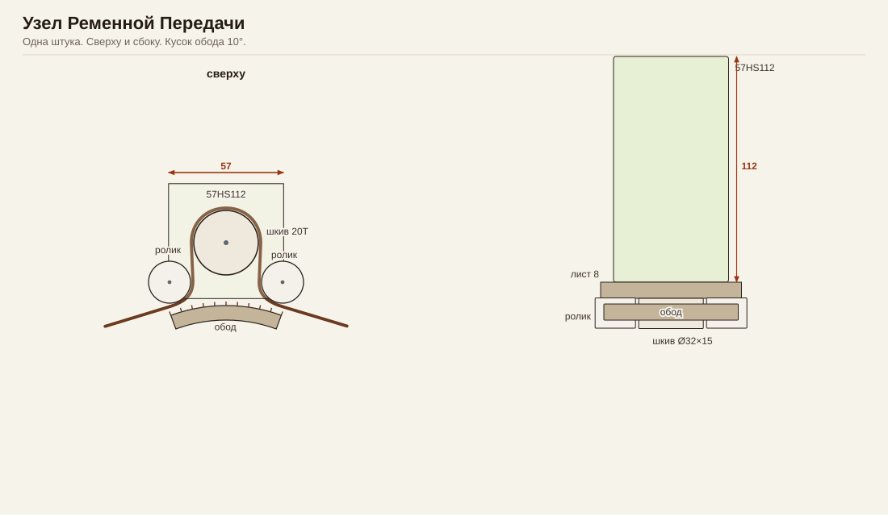

# XY-SCARA: Z, каретка Y, оси A и B

Оси станка: **Z** (моторы Z1 и Z2 ходят синхронно), **Y** (каретка по горизонтальному рельсу), **A** и **B** (SCARA).

Плечо A лежит выше плеча Б. Кинематика как у Тоблера 2016 и meArm, только крупнее и в стали: оба привода на каретке, локоть без мотора. Ось A на переднем крае каретки. Оси Z на стене, за неё рука не заходит. Зона перед стеной — полукруг радиусом до 900 мм. Ближе 230 мм к оси A голова не доходит.

## Оси

| Ось | Что движется |
|---|---|
| Z, моторы Z1 и Z2, оба на стене | рельс Y целиком, оба конца вместе |
| Y | каретка по этому рельсу |
| A | первое плечо, верхняя плоскость |
| B | второе плечо, нижняя плоскость; мотор стоит на каретке |

Положение головы: высота = Z, вдоль станка = Y плюс доля руки, вылет = рука от оси A.

## Откуда кинематика


Файлы Тоблера: [thing:1718984](https://www.thingiverse.com/thing:1718984/files). Берём расклад и форму узлов, не пластик и не вертикальную плоскость.

| деталь Тоблера | здесь |
|---|---|
| LowerShank | плечо A, уголок ×2 по высоте, 450 |
| UpperShank | плечо Б, уголок ×2, короткий вынос, затем 450 |
| Lever | кривошип 90 на редукторе B, тяга на хвост Б |
| Pleuel | прямая тяга, один слой, 450 |
| Pleuel_bend (2 шт.) | изогнутые тяги, один слой: одна вдоль A, одна вдоль Б |
| triplate | плита локтя, треугольник, лист 8–10 мм |
| поворот базы | ось Y |

Плечи мощные, два слоя уголка, но не рядом: верх A на ярусе 1, низ A на ярусе 5. Тяги и плиты — один слой каждый, на пальцах со сдвигом.

## Схемы


Z1 и Z2 прикручены к стене и ходят как одна координата. Каретка на рельсе — ось Y. Ось A на переднем крае каретки.


Прямая тяга с подшипника каретки на зад триплаты. Два мотора на ободах. Плита головы — перевёрнутая Т.


A 5…62°, B 155°/185°. Обод A 90°, B 60°.


Ярусы сверху вниз: верх A и тяга к голове; плита локтя; прямая тяга; мотор B; обод B, треугольник, шкив; тяга B и вынос Б; мотор A; низ A и обод A. Плечи Б — отдельно, не на тяге B.


Вилка, изгиб, плита локтя, ухо B 90, плита головы, плита узла 57HS112.

## Рука

Инструмент до 2 кг жёстко на перекладине плиты головы, с комнаты. Изогнутая тяга Б — на глазу к стене. Ножка Т вертикальна.

На плите локтя сходятся плечо A, тяга ориентации и тяга на голову. Мотор B толкает вынос плеча Б.

Параллелограмм передаёт усилие, пока кривошип не выстраивается в линию с тягой. Поэтому в программу не входят вытянутая прямая, около 900 мм, и складка дальше примерно 150°. На 150° голова остаётся около 230 мм от оси A. Рабочий вылет примерно от 230 до 850 мм. По рельсу Y эта ближняя полоса у стены сдвигается вместе с кареткой.

```text
cos B = (x² + y² − 2L²) / (2L²)
B = ±arccos(...)
A = atan2(y, x) − atan2(sin B, 1 + cos B)
```

Знак B — локоть по одну или по другую сторону от цели. Переброс через вытянутое положение в одном ходе не делается. Линейная Y прибавляется отдельно. В формуле B — относительный угол в локте. Команда мотора B — мировой угол плеча B: A + B. Внутренний палец ориентации — подшипник на каретке, не на уголке A.

Люфт сидит в опорах A и B и во втулках вилок.

## Привод A и B

Угол A с одной Y: мировой **180…240°**, ход **60°**. Полный оборот не нужен.



Узел 57HS112. Сверху и сбоку. Кусок обода 10°.

Два мотора **57HS112**. Ободы на каретке Y. Моторы едут по ремню. HTD5M 20T.

**A.** Центр — UCP вала A. Сектор **90°**, **R=110**. Мотор на низу A, 110 мм от оси, вдоль плеча. Шкив сразу под низом. Передача ≈ **7:1**.

**B.** Центр — вал B, база **110 мм** от A. **R=110**, сектор **60°** в комнату. Кривошип 90: глаз 3 на окружности 90 мм, мотор на ободе. Треугольник B ярусом выше верха 57HS112 A, зазор **15 мм**. Глаз 1 вал B, глаз 2 узел на ободе, глаз 3 тяга 450 на хвост Б.

Ремень зажат по краям дуги, через шкив. Сталь обода 3–5 мм, спицы, вырезы. Минимум R≈80.

Планетарка 10:1…20:1 или волновая 50:1…100:1 — если покупать готовое: выход на вал A и на кривошип B, муфтой или фланцем. Ремень 20T/60T 3:1 не нужен.

Тяги, пальцы и вилки считаем под момент на кривошипе. Рельс Y и колонны Z держат массу.

## Плита каретки и локоть

У UCP204 вал параллелен подошве. Обе опоры болтятся к одной вертикальной плите: одна сверху, вторая снизу. Вал Ø20 Ст45 проходит через обе. Если выход волновой больше — переходная планшайба, опоры те же.

На каретке между центрами A и B 110 мм. Плита стоит на каретке, ось A у переднего края, без выноса. Плечо A — два уголка на валу выше верхней опоры. Кривошип B — треугольник на валу B: узел на ободе R=110, тяга с третьего глаза, палец Ø12.

На локте пара UCP204, мотора нет. Плита локтя — лист 8–10 мм с плазмы, треугольник: глаза 1–2 на 90 мм, глаз 3 сбоку, третье ребро замыкает 2 и 3. Не равносторонний клевер. Из 1 — плечо A, из 2 — прямая тяга, из 3 — изогнутая тяга Б. На выносе Б — тот же палец Ø12 со втулкой, куда садится изогнутая тяга A.

Вес вокруг A и B момента не создаёт: оси вертикальные. Моторы крутят инерцию. Изгиб от головы принимают пары UCP204 и две колонны Z.

## Сталь: тяги и вилка

Тяги один слой, труба 25×25×2. Прямая тяга без слома. Изогнутая тяга — длинная часть вдоль плеча, слом к глазу 3. Вилка: две щёки 6 мм, круглый глаз, приварены к торцу с зазором под плиту. Палец Ø12, гайка самоконтрящаяся, втулка бронза или 6201.

На пальце плиты локтя два звена садятся со сдвигом по высоте и проставкой. Плечо-уголок на этот палец не садится: у Б свой короткий вынос. Шаровая SI16 не нужна.

## Z и Y

Две колонны прикручены к стене, на каждой свой привод. В прошивке это одна ось Z. При базировании концы рельса выравниваются по двум датчикам, дальше Z1 и Z2 едут вместе. Перекос на миллиметр зажимает каретку.

Каретка Y — обычная линейная ось, шаг постоянный. Ход равен длине рельса за вычетом каретки.
