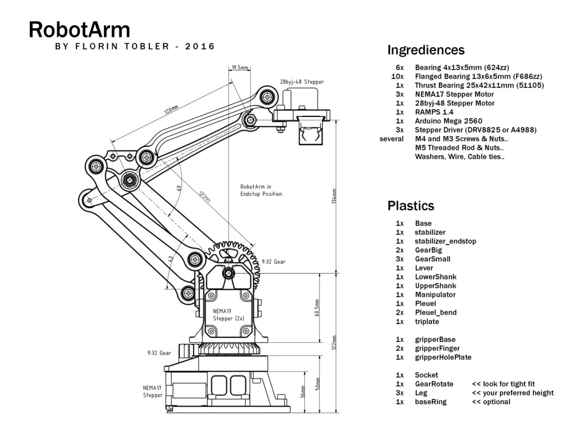
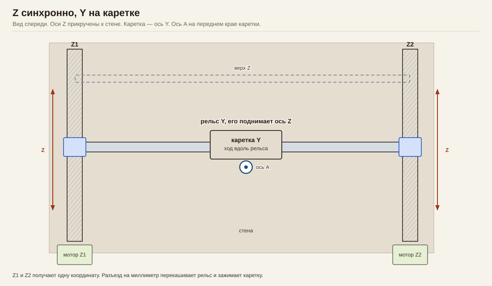
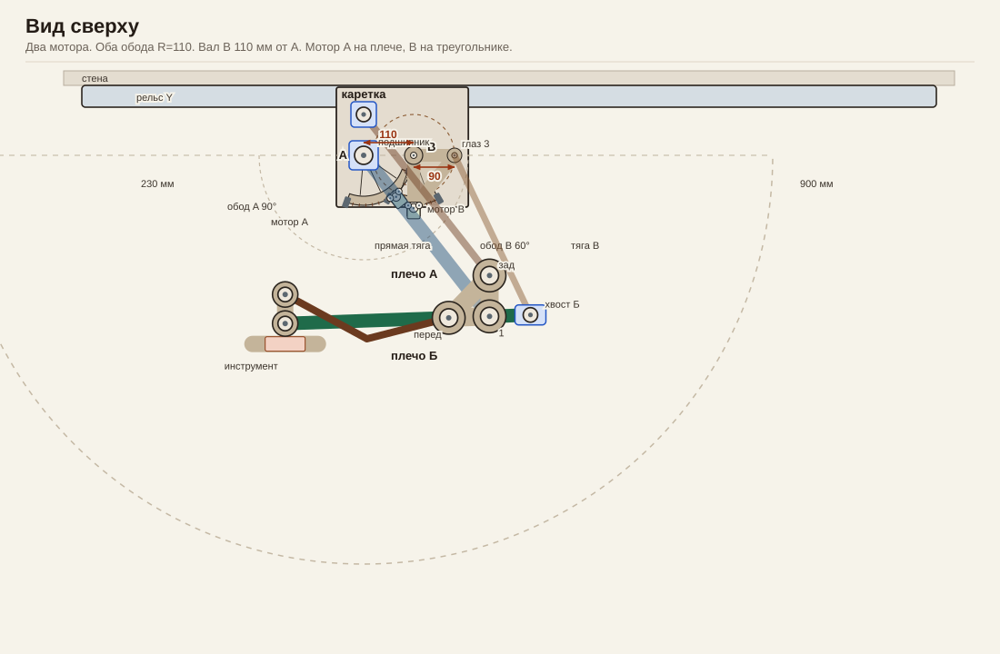
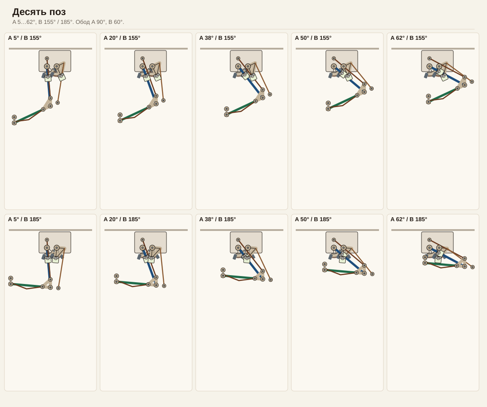
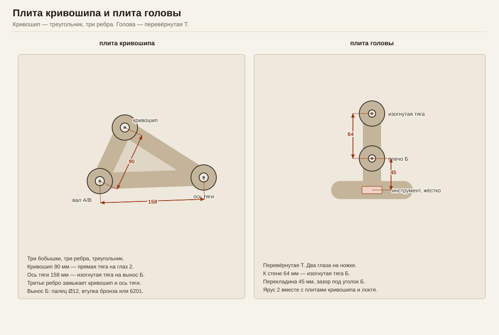
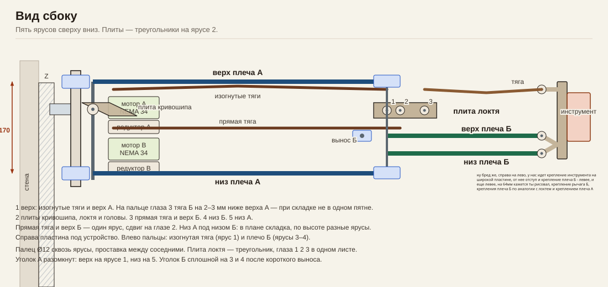
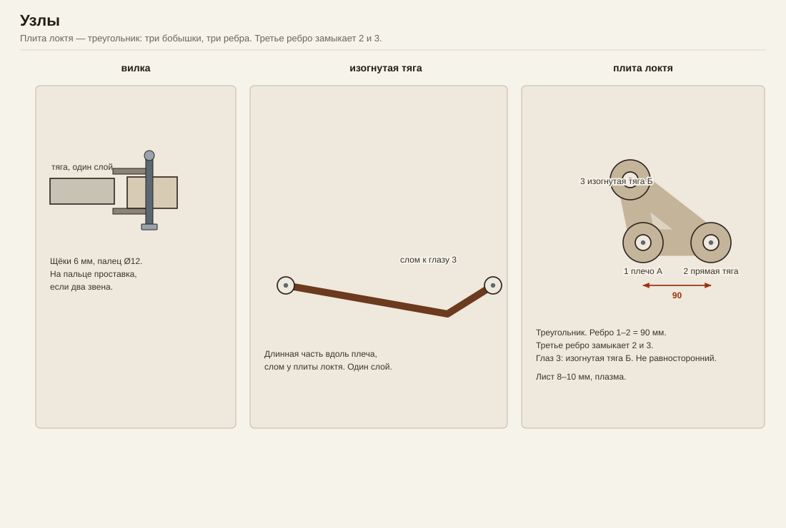

# XY-SCARA: Z, каретка Y, оси A и B

Оси станка: **Z** (моторы Z1 и Z2 ходят синхронно), **Y** (каретка по горизонтальному рельсу), **A** и **B** (SCARA).

Плечо A лежит выше плеча Б. Кинематика как у Тоблера 2016 и meArm, только крупнее и в стали: оба привода на каретке, локоть без мотора. Ось A на переднем крае каретки. Оси Z на стене, за неё рука не заходит. Зона перед стеной — полукруг радиусом до 900 мм. Ближе 230 мм к оси A голова не доходит.

## Оси

| Ось | Что движется |
|---|---|
| Z, моторы Z1 и Z2, оба на стене | рельс Y целиком, оба конца вместе |
| Y | каретка по этому рельсу |
| A | первое плечо, верхняя плоскость |
| B | второе плечо, нижняя плоскость; мотор стоит на каретке |

Положение головы: высота = Z, вдоль станка = Y плюс доля руки, вылет = рука от оси A.

## Откуда кинематика



Файлы Тоблера: [thing:1718984](https://www.thingiverse.com/thing:1718984/files). Берём расклад и форму узлов, не пластик и не вертикальную плоскость.

| деталь Тоблера | здесь |
|---|---|
| LowerShank | плечо A, уголок ×2 по высоте, 450 |
| UpperShank | плечо Б, уголок ×2, короткий вынос, затем 450 |
| Lever | кривошип 90 на редукторе B |
| Pleuel | прямая тяга, один слой, 450 |
| Pleuel_bend (2 шт.) | изогнутые тяги, один слой: одна вдоль A, одна вдоль Б |
| triplate | плита локтя, треугольник, лист 8–10 мм |
| поворот базы | ось Y |

Плечи мощные, два слоя уголка, но не рядом: верх A на ярусе 1, низ A на ярусе 5. Тяги и плиты — один слой каждый, на пальцах со сдвигом.

## Схемы



Z1 и Z2 прикручены к стене и ходят как одна координата. Каретка на рельсе — ось Y. Ось A на переднем крае каретки.



На валу — плита кривошипа треугольником: вал, кривошип 90, ось тяги. Плита локтя тоже треугольник: 1 плечо A, 2 прямая тяга, 3 изогнутая тяга Б. Плита головы — перевёрнутая Т. На выносе Б — подшипник.
*правки: прямая тяга на плече А должна быть зафиксирована на корпус коретки, соотвественно деталь для на точке крепления плеча А нужно пересмотреть. так же пресмотреть положение точек крепления тяг плеча А, скорее всего точка крепления изогнутой тяги на голове тоже должно быть другое, левее.*



Одни и те же длины звеньев, крутятся только A и кривошип. Ножка плиты головы вертикальна.
*правки: левые и правые оставить, 4 изображения, вместо остальных просчитать еще варианты когда движется по X и по Y линейно.*



Лист 8–10 мм, три ребра. Голова — два глаза, перекладина 45 мм.



Сверху вниз: изогнутые тяги и верх A; плиты; прямая тяга и верх Б; низ Б; низ A. Складка: изогнутая тяга Б и верх A на одном ярусе — проставка 2–3 мм на пальце, не одно пятно.
*правки: тяги висят ввоздухе, доработать их крепление. деталь к которой крепятся подшипники локтя, доработать. голова вообще не туда, не соотвествует виду сверху и вообще непонятно что изображает. начало плеча А тоже вообще оторвано от реальности.*



Вилка однослойной тяги, изгиб изогнутой тяги, плита локтя треугольником.

## Рука

Инструмент до 2 кг жёстко на перекладине плиты головы, с комнаты. Изогнутая тяга Б — на глазу к стене. Ножка Т вертикальна.

На плите локтя сходятся плечо A, прямая тяга и изогнутая тяга Б. Угол редуктора B совпадает с углом плеча Б.

Параллелограмм передаёт усилие, пока кривошип не выстраивается в линию с тягой. Поэтому в программу не входят вытянутая прямая, около 900 мм, и складка дальше примерно 150°. На 150° голова остаётся около 230 мм от оси A. Рабочий вылет примерно от 230 до 850 мм. По рельсу Y эта ближняя полоса у стены сдвигается вместе с кареткой.

```text
cos B = (x² + y² − 2L²) / (2L²)
B = ±arccos(...)
A = atan2(y, x) − atan2(sin B, 1 + cos B)
```

Знак B — локоть по одну или по другую сторону от цели. Переброс через вытянутое положение в одном ходе не делается. Линейная Y прибавляется отдельно. В формуле B — относительный угол в локте. Команда мотора B — мировой угол плеча B: A + B. Ось тяги крутится с валом B, не стоит на каретке.

Люфт сидит в опорах A и B и во втулках вилок.

## Привод A и B

На каретке два **NEMA 34** (фланец 86 мм), у каждого свой редуктор. Ремень 20T/60T не нужен: выход редуктора садится на вал A и на кривошип B напрямую, муфтой или фланцем. Валы вертикальные, соосны.

Планетарка 10:1…20:1 проще купить, длиннее по оси, люфт шестерён остаётся. Волновая 50:1…100:1 короче, почти без люфта, выход — фланец. Дороже, в гараже не чинится. Оба корпуса стоят на одной плите.

Момент на кривошипе на порядок выше, чем у NEMA 23 с ремнём 3:1. Тяги, пальцы и вилки считаем под этот момент. Два NEMA 34 плюс два редуктора — килограммы на каретке: рельс Y и колонны Z держат массу, не крутящий момент руки.

## Плита каретки и локоть

У UCP204 вал параллелен подошве. Обе опоры болтятся к одной вертикальной плите: одна сверху, вторая снизу. Вал Ø20 Ст45 проходит через обе. Если выход волновой больше — переходная планшайба, опоры те же.

На каретке между центрами около 200 мм. Плита стоит на каретке, ось A у переднего края, без выноса. Плечо A — два уголка на валу выше верхней опоры. Кривошип 90 мм — полоса 50×8, зажат на выходе редуктора B. На конце — проушина под палец Ø12.

На локте пара UCP204, мотора нет. Плита локтя — лист 8–10 мм с плазмы, треугольник: глаза 1–2 на 90 мм, глаз 3 сбоку, третье ребро замыкает 2 и 3. Не равносторонний клевер. Из 1 — плечо A, из 2 — прямая тяга, из 3 — изогнутая тяга Б. На выносе Б — тот же палец Ø12 со втулкой, куда садится изогнутая тяга A.

Вес вокруг A и B момента не создаёт: оси вертикальные. Моторы крутят инерцию. Изгиб от головы принимают пары UCP204 и две колонны Z.

## Сталь: тяги и вилка

Тяги один слой, труба 25×25×2. Прямая тяга без слома. Изогнутая тяга — длинная часть вдоль плеча, слом к глазу 3. Вилка: две щёки 6 мм, круглый глаз, приварены к торцу с зазором под плиту. Палец Ø12, гайка самоконтрящаяся, втулка бронза или 6201.

На пальце плиты локтя два звена садятся со сдвигом по высоте и проставкой. Плечо-уголок на этот палец не садится: у Б свой короткий вынос. Шаровая SI16 не нужна.

## Z и Y

Две колонны прикручены к стене, на каждой свой привод. В прошивке это одна ось Z. При базировании концы рельса выравниваются по двум датчикам, дальше Z1 и Z2 едут вместе. Перекос на миллиметр зажимает каретку.

Каретка Y — обычная линейная ось, шаг постоянный. Ход равен длине рельса за вычетом каретки.
